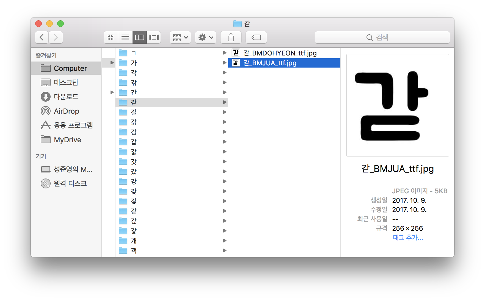

# ttf-to-jpg

> python implement that makes .ttf/.otf files to .jpg set **JUST KOREAN**

## Screenshot



## requirement
- Python 3.6
- Pillow 4.2.1

```
pip install -r requirements.txt
```

## usage
> there are two example fonts (.ttf/.otf) in ttf_dir

```
ttf-to-jpg.py [-h] [--ttf_dir TTF_DIR] [--jpg_dir JPG_DIR]
                     [--size SIZE] [--offset OFFSET]
 ```

#### help
```
python ttf-to-jpg.py --help
```

#### arguments
- `ttf_dir` : directory that includes .ttf files
- `jpg_dir` : directory that includes results of .jpg
- `size` : size of result jpg
- `offset` : offset (padding)


## Thanks to :)
- code reference : [zi2zi/font2img.py](https://github.com/kaonashi-tyc/zi2zi/blob/master/font2img.py) by kaonashi-tyc
- example fonts : [우아한 형제들, 배달의민족 무료 폰트(주아체, 연성체)](http://font.woowahan.com/) by 우아한 형제들